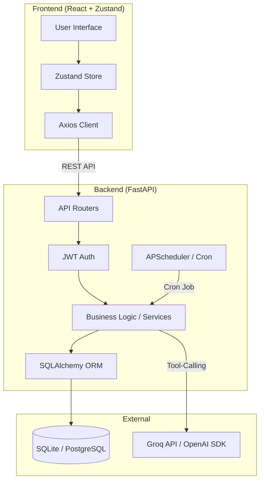

# SmartStore AI — Intelligent Inventory & Vendor Management System

## 1. Project Description
SmartStore AI is an intelligent inventory and vendor management system designed to streamline retail and supply chain operations. By integrating AI-assisted chat and automated background jobs, it helps managers monitor stock levels, forecast inventory needs, and automatically generate purchase orders when items fall below a critical threshold. The goal is to reduce manual administrative work and prevent out-of-stock scenarios.

## 2. Architecture Diagram


## 3. Tech Stack & Versions
**Backend:**
- **FastAPI** (v0.115.0) - High performance async API framework
- **SQLAlchemy** (v2.0.35) - ORM for database interactions
- **Pydantic** (v2.9.2) - Data validation and settings management
- **APScheduler** (v3.10.4) - Background task scheduling
- **Uvicorn** (v0.30.6) - ASGI server
- **OpenAI Python SDK** (v1.51.2) - LLM integration

**Frontend:**
- **React** (v18.3.1) - UI library
- **Vite** (v5.4.8) - Build tool and development server
- **TailwindCSS** (v3.4.13) - Utility-first styling
- **Zustand** (v5.0.0) - Lightweight state management
- **React Router DOM** (v6.27.0) - Client-side routing

## 4. Local Setup

### Prerequisites
- Python 3.10+
- Node.js 18+

### Step-by-Step Installation

**1. Clone the repository**
```bash
git clone <repository_url>
cd smartAi-main
```

**2. Backend Setup**
```bash
cd backend
python -m venv .venv
# Activate virtual environment
source .venv/bin/activate      # On macOS/Linux
# .venv\Scripts\activate       # On Windows

pip install -r requirements.txt
cp .env.example .env           # Edit .env to add your OPENAI_API_KEY (Groq API Key)

# Run the development server
uvicorn main:app --reload
```

**3. Frontend Setup**
```bash
cd ../frontend
npm install
cp .env.example .env           # Edit .env if needed

# Run the frontend dev server
npm run dev
```

## 5. Running the Scheduled Automation Job Manually

The application uses APScheduler to run a daily cron job that checks for low-stock products and automatically creates draft purchase orders. To trigger this process manually for demonstration purposes, you can use the Python interactive shell from within the `backend` directory:

```bash
cd backend
source .venv/bin/activate  # On Windows: .venv\Scripts\activate
python
```
Inside the python REPL:
```python
from services.scheduler_service import scheduler_service
# Manually invoke the automation task
scheduler_service._run_low_stock_automation()
```
*Note: This queries the database for any product at or below its threshold and generates a draft PO assigned to the default supplier.*

## 6. Known Limitations & Future Improvements
If given more time, the following areas would be prioritized:
- **Database Migration to PostgreSQL:** The current setup defaults to SQLite for immediate local testing. Production deployment should use PostgreSQL for better concurrency.
- **Robust Schema Migrations:** Implementing Alembic to manage database schema changes programmatically over time.
- **Role-Based Access Control (RBAC):** Strengthening the middleware to enforce strict admin-only API routes (e.g., supplier deletion) rather than just frontend UI hiding.
- **Real OCR Integration:** The current invoice parsing endpoint (`/ai/invoice/parse`) is a placeholder demo. This would be integrated with AWS Textract or a dedicated vision model.
- **End-to-End Testing:** Adding comprehensive tests using pytest for the backend and Cypress/Playwright for the frontend.
- **Dockerization:** Providing a `docker-compose.yml` to spin up the frontend, backend, and a Postgres instance seamlessly with a single command.

## 7. LLM/AI Provider Details
- **Provider:** **Groq** (accessed via the OpenAI Python SDK compatibility layer targeting `api.groq.com`).
- **Why we chose it:** We selected Groq due to its ultra-low latency inference powered by its specialized LPU architecture. For an interactive chat assistant that relies heavily on **tool-calling** (querying the database for stock levels, PO history, and product details), latency is the primary bottleneck. Groq ensures that the multi-turn conversations required for executing these functions happen almost instantaneously. This creates a snappy, highly responsive user experience that traditional LLM providers struggle to match.

---

## Appendix: Additional Project Details

### Folder Structure
```text
smartAi/
├── backend/
│   ├── core/
│   ├── db/
│   ├── models/
│   ├── routers/
│   ├── schemas/
│   ├── services/
│   ├── utils/
│   ├── uploads/
│   ├── main.py
│   ├── requirements.txt
│   └── .env.example
├── frontend/
│   ├── src/
│   │   ├── components/
│   │   ├── hooks/
│   │   ├── pages/
│   │   ├── routes/
│   │   ├── services/
│   │   ├── store/
│   │   └── utils/
│   ├── package.json
│   └── .env.example
└── README.md
```

### Backend API Key Features
- **RESTful Routers:** Modular endpoints for auth, products, suppliers, purchase orders, AI, and health.
- **Pydantic Validation:** Strict request/response schema separation.
- **Auth:** JWT access token authentication + refresh token endpoints.
- **Endpoints of Interest:**
  - `GET /products/{id}/forecast` (Moving average forecasting)
  - `POST /ai/chat` (LLM tool-calling endpoints for real DB context)

### Frontend Key Features
- **Route Protection:** Redirects unauthenticated users to `/login`.
- **Global State:** Zustand auth store to avoid prop drilling.
- **API Interceptors:** Axios client automatically attaches JWT tokens.
- **Responsive Layout:** Container-based layouts tailored for tablet and desktop viewports.
# SmartStore_AI
